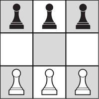

# Exercice 2 (6 points)

L'HexaPion est un jeu de stratégie abstrait minimaliste.

***figure 1***

Sur un mini-échiquier de 3x3 cases, deux joueurs s’affrontent avec trois pions chacun, en respectant les règles classiques de déplacement et de prise des échecs.

En voici les règles du jeu :
1. **Déplacement simple :** un pion peut avancer d'une case en ligne droite vers l'adversaire, à condition que la case de destination soit vide. Un pion ne peut pas reculer.

2. **Capture :** un pion peut "manger" un pion adverse en se déplaçant d'une case en diagonale. La case de destination doit impérativement contenir un pion adverse.

3. **Conditions de victoire :** une partie est gagnée si un joueur remplit l'une des trois conditions de victoire suivantes :

    - **Conquête :** amener un pion sur la ligne de départ de l'adversaire.
    - **Destruction :** capturer tous les pions de l'adversaire.
    - **Blocage :** l'adversaire, à son tour de jouer, ne peut effectuer aucun mouvement légal.
    
L'objectif de cet exercice est d'implémenter les règles de ce jeu et de concevoir un algorithme pour q'une IA soit capable d'apprendre par essais-erreurs pour devenir imbattable.

---

# Partie A : Compréhension et représentations (4.5 points)

**Les cases sont numérotées de 0 à 8, de gauche à droite et de haut en bas.**

.png)***figure 2***

**Les pions blancs (humain) sont représentés par la valeur 1, les pions noirs (IA) par -1 et les cases vides par 0.**


.png)***figure 3***

**On représente la grille de jeu par une variable de type `list` de 9 cases ou liste aplatie**

Ce plateau sera représenté par la liste suivante :

```python
plateau = [-1, -1, -1, 0, 0, 0, 1, 1, 1]
```

## Question 1
À partir de la situation de la Figure 1, si le joueur Blanc déplace son pion de la case 7 vers la case 4, donnez la liste Python représentant le nouvel état du plateau.

Justifiez que ce coup est légal selon les trois règles énoncées plus haut.


#### *Solution :*

**Nouvel état du plateau**

Nouvel état du plateau : [-1, -1, -1, 0, 1, 0, 1, 0, 1]

**Justification :**

Règle appliquée : Selon la règle du déplacement simple, un pion peut avancer d'une case en ligne droite vers l'adversaire si la case de destination est vide.

#### *Barème : **0.50 points** -> 0.25 / réponse*

## Question 2
On considère la situation représentée par la figure 4.

C'est maintenant au joueur noir (IA) de jouer.

.png)***figure 4***

Un coup est défini par un couple d'entiers compris entre 0 et 8 suivant : (Case de départ, Case d'arrivée).

- Lister les coups possibles pour les pions noirs

- Le joueur `Noir` peut-il gagner la partie lors de ce tour d'après les régles du jeu ?

#### *Solution :*

**Coups possibles :**

- (0, 3)
- (1, 5)
- (4, 6)
- (4, 7)

**Condition de victoire et déplacement :**

- La Conquête avec (4, 7) ou (4, 6)

#### Barème : **1 point** -> 0.5 pour les coups + 0.5 le victoire

## Question 3

Pour faciliter la programmation future, on souhaite convertir les coordonnées de type (ligne, colonne) où ligne et colonne varient de 0 à 2 en un indice unique du tableau (de 0 à 8).

Complétez le programme en proposant la formule permettant de calculer cet indice 'aplati' à partir des coordonnées 'ligne' et 'colonne'.

```python
def convertir_indice(ligne: int, colonne: int, plateau: list) -> int:
    """Convertit ligne et colonne en indice (0-8)."""
    ...
```

**Exemple : La case en ligne 1 et en colonne 2 doit correspondre à l'indice 5**

.png)

#### Solution :

Modélisation des données. On propose de représenter la grille par une liste "aplatie" de 9 éléments.

Pour effectuer cette conversion, l'indice 'aplati' correspont à la multipication de la coordonnée 'ligne' par le nombre de colonnes du plateau à laquelle on ajoute la coordonnée 'colonne'


```python
def convertir_indice(ligne: int, colonne: int, plateau: list) -> int:
    """Convertit ligne et colonne en indice (0-8)."""
    return ligne * 3 + colonne    # Tj de dim = 3

plateau = [0, -1, 0, 0, 1, -1, 1, 0, 0]
ligne = 1
colonne = 2

convertir_indice(1, 2, plateau)
```


    5


#### Barème : **1 point** -> 1 pt/réponse

## Question 4

On considère la fonction `jouer_coup()` permettant de jouer un déplacement valide selon les critères de déplacement décrits plus haut.

La fonction prend pour arguments :
- une variable `coup` de type *tuple* comportant deux entiers (case de départ, case d'arrivée)
- une variable `plateau` de type *tuple* comportant neuf entier `tuple(int, int, int, int, int, int, int, int, int)` correspondant aux neuf cases du jeu.

On suppose le coup valide selon les règles énoncées plus haut.

La fonction retourne une nouvelle grille modifiée.

Compléter la fonction `jouer_coup()` :

```python
def jouer_coup(coup: tuple[int, int], plateau: tuple[int]) -> list:
    """Retourne une nouvelle grille après le coup joué."""
    nouvelle_grille = list(plateau)
    ...
    ...
    return tuple(nouvelle_grille)
```

#### Solution


```python
def jouer_coup(coup: tuple[int, int], plateau: tuple[int, ...]) -> list:
    """Retourne une nouvelle grille après le coup joué."""
    nouvelle_grille = list(plateau)
    nouvelle_grille[coup[1]] = nouvelle_grille[coup[0]]
    nouvelle_grille[coup[0]] = 0
    return tuple(nouvelle_grille)

coup = (7, 4)
jouer_coup(coup, plateau)

```


    (0, -1, 0, 0, 0, -1, 1, 0, 0)


#### Barème : **0.50 points** -> 0.25 pts/réponse

## Question 5

Pour quelle raison la variable `nouvelle_grille` est convertie en un type *list* pour ensuite être reconvertie en un type *tuple* ?

#### Solution

Le type tuple de la variable `nouvelle_grille` est non mutable, la conversion de type de cette variable est donc obligatoire pour toute modificication de son contenu.


#### Barème : **0.5 point**

## Question 6

Lorsque que c'est au joueur *humain* de jouer, il faut s'assurer que le choix du déplacement est valide.

Une variable  `coups_list` de type `list` fournit l'ensemble des `tuples` (*case de départ, case d'arrivée*) possibles comme par exemple :

```pyton
coups_list = [(7, 3), (7, 4), (8, 5)]
```
Un test sera effectué au niveau du programme pour vérifier que le coup envisagé fait bien parti de la liste `coups_list`.

Complétez la partie du programme qui permet de faire ce test:

```python
        if joueur == 1:
            coup_valide = False
            print(f"Coups possibles pour l'humain : {coups_list}")
            while not coup_valide:
                    try:        
                        depart = int(input("Case de depart : "))
                        ...
                        ...
                        ...
                        ...
                    except AssertionError:
                        print("Coup invalide. Veuillez réessayer.")
```

#### Solution 

```python
        if joueur == 1:
            coup_valide = False
            print(f"Coups possibles restants pour l'humain : {coups_list}")
            while not coup_valide:
                    try:        
                        depart = int(input("Case de depart : "))
                        arrivee = int(input("Case d'arrivée : "))
                        coup_joue = (depart, arrivee)
                        assert coup_joue in coups_list
                        coup_valide = True
                    except AssertionError:
                        print("Coup invalide. Veuillez réessayer.")
```

#### Barème : **1 point** -> 0.25 pt/ligne

---
# Partie B : Programmation Orientée Objet (xx points)

Dans cette partie, on utilise le paradigme de la programmation orientée objet pour modéliser les coups possibles que l'IA peut jouer à partir d'un plateau donné.

On donne la Classe Coup suivante :

```python
class Coup:
    """Représente un déplacement de pion (départ -> arrivée) et stocke l'état d'origine."""

    def __init__(self, depart: int, arrivee: int, etat_precedent: tuple[int, ...] = None):
        self.etat_precedent = etat_precedent   # On mémorise l'état du plateau avant que ce coup ne soit joué
        self.depart = depart                   # Indice de départ (0-8)
        self.arrivee = arrivee                 # Indice d'arrivée (0-8)
```

## Question 7

Donnez les attributs du constructeur de la classe `Coup` ainsi que leurs types.

#### Solution

- **etat_precedent :** tuple de 9 entiers
- **depart :** entier
- **arrivee :** entier

#### Barème : **0.75 points ->** 0.25 pt / réponse

## Question 8

Proposez une méthode `obtenir_coup()` de la classe `Coup` pour retourner un `tuple` constitué du déplacement d'un point de sa case de départ vers sa case d'arrivée.


#### Solution :


```python
class Coup:
    """Représente un déplacement de pion (départ -> arrivée) et stocke l'état précédent du plateau."""

    def __init__(self, depart: int, arrivee: int, etat_precedent: tuple[int, ...] = None):
        self.etat_precedent = etat_precedent
        self.depart = depart
        self.arrivee = arrivee

    def obtenir_coup(self) -> tuple[int, int]:
        """retourne un tuple coup """
        return (self.depart, self.arrivee)

```

#### Barème : **0.75 points**

## Question 9

La fonction `jouer_coup()` n'est plus adaptée dans ce paradigme de programmation orienté objet.

La fonction prend maintenant pour arguments :
- un objet de type `Coup` comportant les attributs de sa classe `depart`, `arrivee` et `etat_precedent`

La fonction retourne la grille modifiée sous la forme d'un tuple comprenant les huit entier de la grille.

Compléter la fonction jouer_coup_Poo() :

```python
def jouer_coup_Poo(coup: Coup) -> tuple[int, ...]:
    """Retourne une la grille (tuple) après application du coup."""
    ...
```

#### Solution

```python
def jouer_coup_Poo(coup: Coup) -> tuple[int, ...]:
    """Retourne une nouvelle grille (tuple) après application du coup."""
    nouvelle_grille = list(coup.plateau)
    nouvelle_grille[coup.arrivee] = nouvelle_grille[coup.depart]
    nouvelle_grille[coup.depart] = 0
    return tuple(nouvelle_grille)
```

#### Barème : **1 point**

## Question 10

Pour que le joueur IA (pions noirs `-1`) puisse apprendre de ses échecs, il faut mémoriser les coups qui conduisent à une réussite et 'oublier' les coups perdants.

Le principe revient à enregistrer, dans une variable `memoire_ia` de type dictionnaire :

- les clés représentant ses plateaux,
- les valeur sous la forme d'une liste contenant tous les coups possibles qu'elle peut jouer pour ses plateaux.

On considère que l'IA  a déjà mémorisé plusieurs états dans son dictionnaire.

Lors d'une partie contre un humain, l'IA perd après avoir joué le coup `(1, 4)` à partir de l'état `plateau_precedent_ia`. On dispose d'une variable `dernier_coup_ia` qui mémoirise ce dernier coup.

L'état de sa mémoire pour cet état précis était initialement :
`memoire_ia[plateau_precedent_ia] = [(1, 3), (1, 4), (1, 5)]`

La fonction `echec_ia(memoire_ia, dernier_coup_ia, plateau_precedent_ia)` est alors appelée. Elle consiste à retirer le dernier coup joué de la liste des choix possibles pour cet état.

```python
1| def echec_ia(memoire_ia, dernier_coup_ia, plateau_precedent_ia):
2|    """ Retire de la mémoire de l'IA son dernier coup joué qui à conduit à sa echec"""
3|
4|    for coup in memoire[plateau_precedent_ia]:
5|        if coup.obtenir_coup() == dernier_coup_ia.obtenir_coup():
6|            memoire[plateau_precedent_ia].remove(coup)
7|    return memoire_ia
```

**Complétez le tableau de la trace des variables ou instructions ci-dessous :**

| Itération | `coup` | **instruction ligne 5** | **variable memoire_ia ligne 6** |
| :--- | :---: | :---: | :---: |
| 1 | `...` | False | `...` |
| 2 | (1, 4) | `...` | `...` |
| 3 | (1, 5) | `...` | `...` |


#### Solution

| Itération | `coup` | **ligne 5** | **ligne 6** |
| :--- | :---: | :---: | :---: |
| 1 | **(1, 3)** | False | **`[(1, 3), (1, 4), (1, 5)]`** |
| 2 | (1, 4) | **`True`** | **`[(1, 3), (1, 5)]`** |
| 3 | (1, 5) | **`False`** | **`[(1, 3), (1, 5)]`** |

**Barème : 0.75 point -> 0.25/ligne**


```python

```
